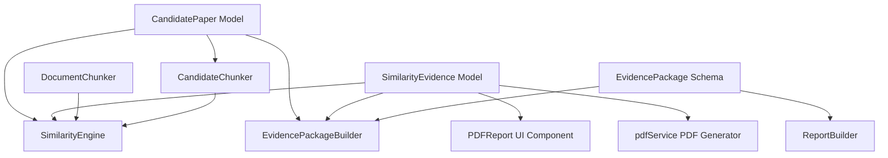

# DEPENDENCY_GRAPH.md

This document maps the flow of dependencies and identifies obsolete, circular, or duplicated elements across the codebase.

---

## Component Dependency Graph

---

## Issues & Audit Findings

### 1. Obsolete Dependencies / Imports
- `SimilarityResult` import inside `EvidencePackageBuilder.ts` and `EvidencePackageBuilder.test.ts`. This interface was deprecated and replaced by `SimilarityEvidence`.
- `MatchingChunk` import inside `EvidencePackageBuilder.ts`. This was replaced by `MatchingPassage`.

### 2. Duplicate Models
- `CorePaper` is used inside `CandidateChunker.test.ts` and `EvidencePackageBuilder.test.ts` instead of the normalized `CandidatePaper` model. This is a duplicate representation issue where the test suite is out of sync with the runtime provider pipeline.

### 3. Circular Dependencies
- No circular dependencies detected in the current TypeScript imports. All packages import cleanly in a hierarchical tree.
