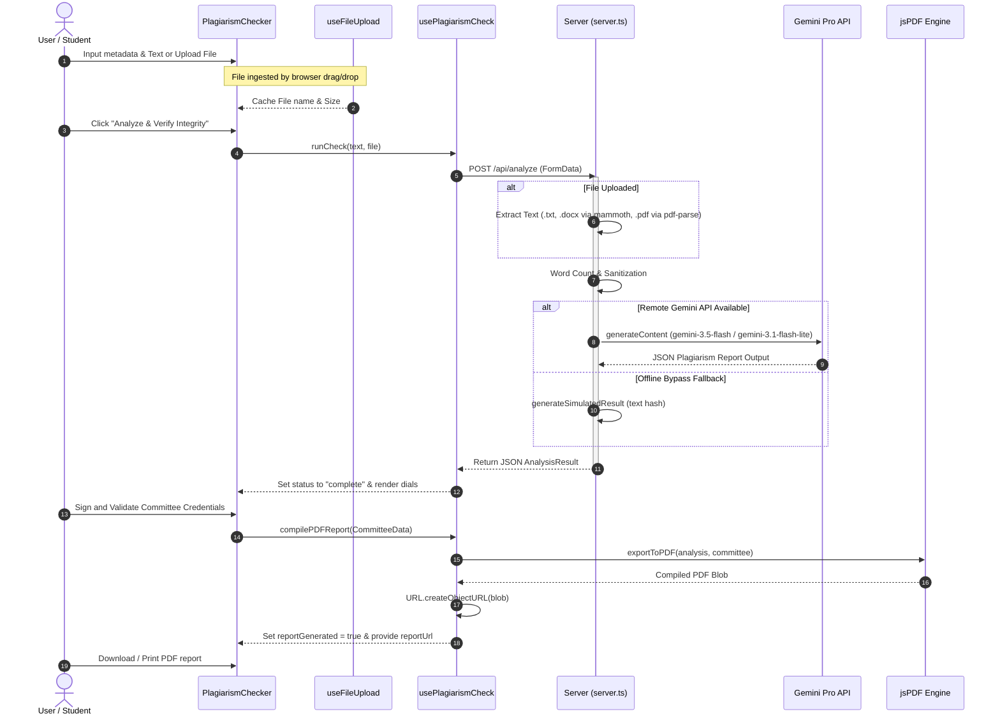

# DSPG Engine Runtime Flow & Execution Pipeline

This document charts the runtime lifecycle, execution sequence, data pipelines, and AI models utilized by the DSPG Plagiarism Checker Engine.

---

## 1. Application Initialization & Start
1. **Server Boot:**
   * Node process starts `server.ts`.
   * Environment variable `GEMINI_API_KEY` is read from `.env` or system variables.
   * Express routes are initialized, mounting cors middleware and static/dev serving setups.
   * If not in production, the server initializes Vite using `createViteServer` and attaches its dev middleware to route client requests dynamically.
2. **Client Load:**
   * React mounts on the DOM via `main.tsx` inside `#root` defined in `index.html`.
   * `App.tsx` initializes, mounting `PlagiarismChecker.tsx`.

---

## 2. Process Sequence Diagram



---

## 3. Data Flow Model

```
[User Form Entry / File Upload]
           │
           ▼
[FormData Payload (text, file)] ──► POST /api/analyze
           │
           ▼
[Text Extraction Engine] (mammoth / pdf-parse / txt converter)
           │
           ▼
[Sanitization & Estimation] (Word count computation)
           │
           ├──────────────────────────────┐ (Fallback)
           ▼                              ▼
[Gemini API Client Session]      [Local Hash-Based Engine]
  • System Instruction             • Computes stable text hash
  • Structured JSON Output         • Generates deterministic stats
  • Schema Validation              • Resolves category templates
           │                              │
           └──────────────┬───────────────┘
                          ▼
               [JSON Analysis Result]
                 ├─ originalityScore
                 ├─ aiProbability
                 ├─ flaggedSections
                 ├─ summary
                 ├─ sources (text, source, similarity)
                          │
                          ▼
               [UI Visual Rendering] (dials & table)
                          │
                          ▼
               [Committee Signatures]
                 ├─ Signature specimens drawn/typed/uploaded
                 ├─ Verification clicks
                 └─ ISO 8601 server-date binding
                          │
                          ▼
            [jsPDF Compilation Engine]
                 ├─ Page 1: Cover Sheet & Procedural Crest
                 ├─ Page 2: Summary Stats & Gauge dials
                 ├─ Page 3: Overlap Index & Severity Table
                 └─ Page 4: Endorsement blocks & Official Seal
                          │
                          ▼
               [Blob & Object URL Link]
```

---

## 4. AI Analysis Pipeline

### Model Selection
The backend implements a fallback model trial chain:
1. `gemini-3.5-flash`
2. `gemini-3.1-flash-lite`

### System Instruction
```
You are a senior academic auditor specializing in engineering papers, representing Delta State Polytechnic Ogwashi-Uku.
```

### Prompt Input Structure
The prompt encapsulates instructions to scan for plagiarism matches, calculate similarity levels, analyze writing burstiness/perplexity to output AI writing probability, and customize an executive summary reflecting DSPG HND guidelines:
```
You are the advanced Academic Plagiarism Checker & Style Analysis System of the Delta State Polytechnic Ogwashi-Uku, School of Engineering, HND Projects Committee.
Your task is to perform an exhaustive, rigorous, and highly detailed originality and plagiarism analysis on the following submitted text.

Analyze the text for:
1. Plagiarism & Copying: Search your knowledge graph for exact or semantic matches with textbooks, IEEE/academic research papers, online libraries, standard engineering codes, and websites. Identify similarity percentages.
2. AI-generated Content: Detect typical AI style patterns, perplexity, burstiness, vocabulary indicators, and repetitive structure to determine the AI-generated content probability.
3. Formulate an academic executive summary customized for the Delta State Polytechnic Ogwashi-Uku School of Engineering standards, highlighting any compliance suggestions or issues.

Provide a structured, detailed JSON response adhering exactly to the specified JSON schema. Do not include markdown code block syntax around the JSON inside the text response itself, return raw JSON string.

Submitted Text to Analyze:
"""
[SUBMITTED TEXT]
"""
```

### Output Response Schema
```json
{
  "type": "OBJECT",
  "properties": {
    "originalityScore": {
      "type": "INTEGER",
      "description": "The overall originality percentage (0-100), where 100 means fully original, 0 means entirely plagiarized."
    },
    "aiProbability": {
      "type": "INTEGER",
      "description": "The probability that the text was written by an AI language model (0-100)."
    },
    "flaggedSections": {
      "type": "ARRAY",
      "items": { "type": "STRING" },
      "description": "A list of distinct key phrases or sections flagged for similarity/plagiarism."
    },
    "summary": {
      "type": "STRING",
      "description": "Executive summary detailing specific findings, Nigerian engineering context, and HND Projects Committee compliance statements."
    },
    "sources": {
      "type": "ARRAY",
      "items": {
        "type": "OBJECT",
        "properties": {
          "text": { "type": "STRING", "description": "The exact phrase or text segment matched." },
          "source": { "type": "STRING", "description": "The source publication, website, standard, or database matched." },
          "similarity": { "type": "INTEGER", "description": "Percentage similarity of this specific segment (0-100)." }
        },
        "required": ["text", "source", "similarity"]
      },
      "description": "A detailed table mapping matches to potential academic or online sources."
    }
  },
  "required": ["originalityScore", "aiProbability", "flaggedSections", "summary", "sources"]
}
```

### Determinism Verification
*   **Remote Gemini Calls:** **Non-deterministic.** The LLM inference process introduces slight variations in similarity metrics and phrasing of summaries based on default generation temperatures.
*   **Offline Fallback Mode:** **Fully deterministic.** Utilizes a stable string hash algorithm mapping character codes to fixed originality indices (81% to 96%) and fixed source lists from discipline-specific categories.
