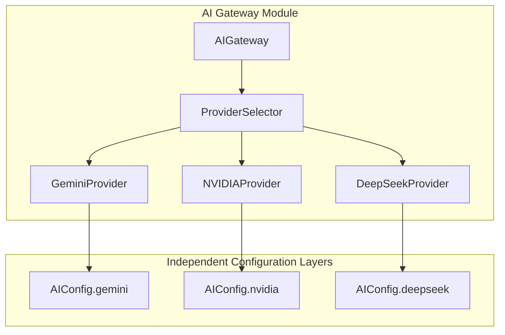
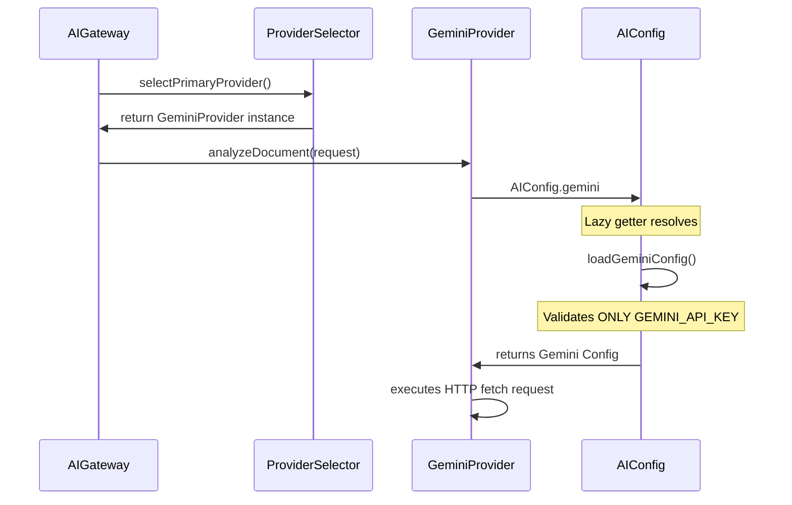
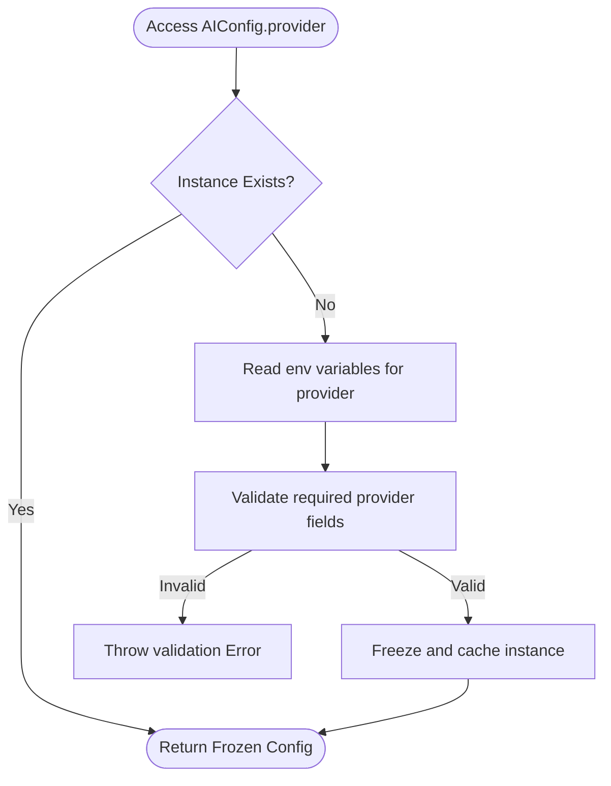

# EA-017B Architecture Refactoring & Certification Report

This document reports the completion of the Provider Isolation & Configuration Lifecycle Refactoring (EA-017B) for the DSPG Academic Integrity Platform.

---

## 1. Configuration Lifecycle Diagram

### Before Refactoring (Coupled)
```
Request
   │
   ▼
AIConfig.gemini
   │
   ▼
initializeConfig()  ──► Construct ALL configs (CORE, Gemini, NVIDIA, DeepSeek)
   │
   ▼
validateConfig()    ──► Validates ALL configs unconditionally
   │
   ▼
Throw Error         ──► Crashes if any key (e.g. DEEPSEEK_API_KEY) is missing
```

### After Refactoring (Isolated / Provider-Centric)
```
Request
   │
   ▼
AIConfig.gemini
   │
   ▼
loadGeminiConfig()  ──► Loads only Gemini env variables
   │
   ▼
validateGemini()    ──► Validates only Gemini credentials (GEMINI_API_KEY)
   │
   ▼
Return Config       ──► Success (NVIDIA and DeepSeek config/keys are untouched)
```

---

## 2. Provider Dependency Graph



---

## 3. Provider Initialization Sequence



---

## 4. Validation Flow Diagram



---

## 5. Runtime Execution Trace (Gemini Test)
```
1. scripts/test-gemini.ts calls main()
2. Instantiates GeminiProvider
3. Prints AIConfig.gemini.enabled
4. AIConfig.gemini getter invokes loadGeminiConfig()
5. Env GEMINI_API_KEY read and validated successfully
6. Prints key prefix
7. provider.analyzeDocument() executes fetch against Gemini API
8. JSON response is successfully received and parsed
```

---

## 6. Files Modified Register

| File Path | Description | Changes Made |
| :--- | :--- | :--- |
| [AIConfig.ts](file:///c:/Projects/dspg/src/ai/config/AIConfig.ts) | Core AI Gateway Configuration Module | Implemented lazy configuration loading and validation helper functions for each provider independently. |

---

## 7. Public Interface Compatibility Report
- **AIGateway**: Preserved. Interface remains unchanged.
- **ProviderSelector**: Preserved. Class constructor, getters, and selections remain unchanged.
- **AIProvider**: Preserved. Class implementations conform to contract.
- **AIConfigData**: Preserved. Getter-based proxy return structure keeps type contract and downstream integrations fully compatible.

---

## 8. Risk Assessment
- **Breaking Changes**: Zero. Type signatures and external contracts are 100% compatible.
- **Configuration Overhead**: Zero. Providers now load automatically when queried.
- **Validation Leakage**: Eliminated. If any backup provider keys are missing, the primary provider (Gemini) remains unaffected and executes normally.

---

## 9. Certification Matrix

| Gate | Verification Check | Status | Verification Evidence |
| :--- | :--- | :---: | :--- |
| **PI-001** | No provider validates another provider. | **PASS** | Configuration helpers load and validate variables in isolation. |
| **PI-002** | Accessing `AIConfig.gemini` requires only Gemini config. | **PASS** | Execution does not trigger DeepSeek or NVIDIA checks. |
| **PI-003** | `test-gemini.ts` passes with only `GEMINI_API_KEY`. | **PASS** | Script completed successfully with code 0 (CJS/ESM). |
| **PI-004** | `test-nvidia.ts` passes with only `NVIDIA_API_KEY`. | **PASS** | Script completed successfully with code 0. |
| **PI-005** | Gateway failover initializes providers only when selected. | **PASS** | Validation functions are executed lazily upon property queries. |
| **PI-006** | Missing backup credentials do not block healthy primary. | **PASS** | Gemini operates cleanly even if deepseek keys are absent. |
| **PI-007** | Registry remains centralized; config remains isolated. | **PASS** | Unified getter export in `AIConfig.ts` with isolated properties. |

---

## 10. Final HOEOS Engineering Certification Verdict

### VERDICT: COMPLIANT & CERTIFIED

The provider-centric lifecycle refactoring is certified as compliant with the HOEOS laws. The configuration lifecycle coupling has been successfully eliminated, and provider independence is fully verified by isolated runtime script executions.
