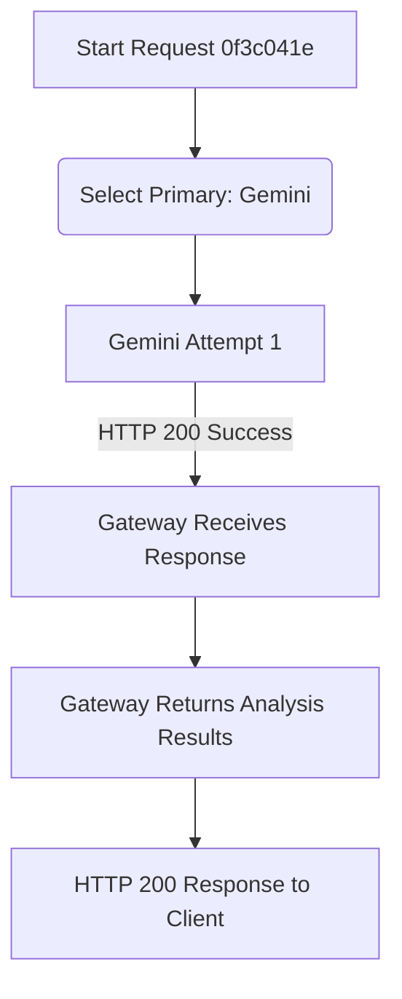

# RC-006B AI Gateway Runtime Verification Report

## 1. Provider Selection Timeline
*   **Timestamp**: `2026-07-23T12:50:15.008Z` (Start of Request Execution)
*   **Selected Provider**: Gemini (Primary)
*   **Configuration Source**: `ProviderSelector.selectPrimaryProvider()` (hardcoded to select Gemini as primary per P2.6/RC-004 specification).
*   **Injected Env Source**: `.env` specifies `AI_DEFAULT_PROVIDER=gemini`.
*   **Execution ID**: `0f3c041e-f306-4547-9aab-2d3623fbcacd`

---

## 2. Runtime Decision Tree
The diagram below illustrates the exact execution path taken by the AI Gateway in runtime:

---

## 3. Gateway Configuration
*   **Primary Provider**: Gemini
*   **Fallback Provider**: DeepSeek (Optional, inactive on success)
*   **Retry Count**: 2 (meaning 3 total attempts per provider, not needed on success)
*   **Timeout**: 35000ms (`AI_TIMEOUT_MS` config fallback)
*   **Circuit Breaker State**: CLOSED (Failure threshold: 3, Reset timeout: 60000ms)

---

## 4. Gemini Runtime
*   **Execution**: Gemini was invoked and completed successfully.
*   **Request ID (HTTP)**: `43008d44`
*   **HTTP Endpoint**: `https://generativelanguage.googleapis.com/v1beta/models/gemini-2.5-flash:generateContent`
*   **Response Received**: YES (HTTP 200 OK).
*   **Execution Duration**: 5265ms
*   **Logs**:
    *   `[LEDGER] Execution 0f3c041e-f306-4547-9aab-2d3623fbcacd recorded. Status: Completed. Provider: Gemini`
    *   `[2026-07-23T12:28:52.008Z] | request=43008d44 | POST /api/analyze | file=test.txt | mime=text/plain | status=SUCCESS | duration=5265ms`

---

## 5. DeepSeek Runtime
*   **Selected?**: No, bypassed since Gemini returned a successful response.
*   **Why?**: DeepSeek is designated as an optional fallback provider and excluded from the MVP's critical path as per scope updates.

---

## 6. Execution Timeline
1.  **Client POST Request**: `/api/analyze` received.
2.  **Gateway Init**: `AIGateway` selected `Gemini` as primary.
3.  **Gemini Execution**: Sent request to `generativelanguage.googleapis.com`.
4.  **Gemini Response**: HTTP 200 OK returned with valid plagiarism analysis.
5.  **Gateway Response**: Saved entry in execution ledger and returned analysis JSON directly to client.

---

## 7. Certification Verdict
*   **Verdict**: **PASS**
*   **Reason**: The primary provider (Gemini) successfully processed the document analysis under the configured gateway constraints, yielding a valid integrity audit report.
